[](README.en.md)
[](README.zh-tw.md)

# 🤖 AI Butler - Line Bot with Gemini & Google Calendar

This is a LINE chatbot that integrates **Google Gemini AI** and **Google Calendar**.
It understands natural language, helping families or individuals easily manage schedules via LINE, and presents results using beautiful **Flex Message** cards.

## ✨ Features

* **Natural Language Processing**: No rigid commands required. Just say "Dinner tomorrow at 7 PM" or "What's on schedule next week?".
* **Two-way Integration**:
  * **Create Events**: Automatically parses time, location, and details to sync with Google Calendar.
  * **Query Events**: Supports fuzzy queries (e.g., "next week") and returns a list of events.
* **UI Optimization**: Uses **LINE Flex Messages** to present event cards and lists with a clean and aesthetic interface.
* **Group Friendly**: Supports a "Trigger Word" mechanism (e.g., "Butler") to avoid disrupting daily conversations in group chats.
* **Serverless Architecture**: Deployed on Google Cloud Functions (Gen 2) for low cost and high stability.
* **Batch Event Creation (New!)**: Supports listing multiple dates and times in a single message (e.g., for recurring therapy or classes). The AI applies a "Shared Title Strategy" to create multiple events instantly.

## 🏗️ Architecture

```mermaid
graph TD
    %% 1. Define Styles
    classDef line fill:#06c755,stroke:#fff,stroke-width:2px,color:#fff;
    classDef gcp fill:#4285F4,stroke:#fff,stroke-width:2px,color:#fff;
    classDef ai fill:#FFD700,stroke:#333,stroke-width:2px,color:#333;
    classDef user fill:#fff,stroke:#333,stroke-width:2px;

    %% 2. Define Nodes
    User("👤 User/Family Member")
    LineApp["📱 LINE App"]
    LinePlatform["LINE Messaging API"]
    
    subgraph GoogleCloud ["☁️ Google Cloud Platform"]
        CloudFunc["⚡ Cloud Functions <br/>(Node.js 20)"]
    end
    
    subgraph GoogleServices ["🧠 Google AI & Data Services"]
        Gemini["✨ Gemini 2.5 Flash <br/>(Semantic Analysis)"]
        Calendar["📅 Google Calendar <br/>(Event Database)"]
    end

    %% 3. Define Connections
    User -->|"1. Input Message (Trigger Word)"| LineApp
    LineApp -->|"2. Send"| LinePlatform
    LinePlatform -->|"3. Webhook POST"| CloudFunc
    
    CloudFunc <==>|"4. Parse Intent (Create/Query)"| Gemini
    CloudFunc <==>|"5. Read/Write Events (ISO 8601)"| Calendar
    
    CloudFunc -->|"6. Generate Flex Message"| LinePlatform
    LinePlatform -->|"7. Display Card"| LineApp

    %% 4. Apply Styles
    class User user
    class LineApp,LinePlatform line
    class CloudFunc,Calendar gcp
    class Gemini ai
```



## 🛠️ Tech Stack

* **Runtime**: Node.js 20
* **Cloud Platform**: Google Cloud Platform (Cloud Functions)
* **AI Model**: Google Gemini 2.5 Flash
* **Messaging**: LINE Messaging API
* **Database**: Google Calendar API
* **DevOps**: GitHub Actions(Optional), gCloud CLI

## 🚀 Quick Start

### Prerequisites

1. Google Cloud Platform Account (Billing enabled).
2. LINE Developers Account (Create a Messaging API Channel).
3. Gemini API Key (Google AI Studio).

### Local Development

1. **Clone the Repository**

    ```bash
    git clone [https://github.com/YourName/linebot-ai-butler.git](https://github.com/YourName/linebot-ai-butler.git)
    cd linebot-ai-butler
    ```

2. **Install Dependencies**

    ```bash
    npm install
    ```

3. **Set Environment Variables**
    Copy `.env.example` to `.env` and fill in the following information:

    ```env
    CHANNEL_ACCESS_TOKEN=你的LINE_Token
    CHANNEL_SECRET=你的LINE_Secret
    GEMINI_API_KEY=你的Gemini_Key
    CALENDAR_ID=你的Google日曆ID
    ```

4. **Start Local Server**

    ```bash
    npx @google-cloud/functions-framework --target=lineWebhook --port=8080
    ```

5. **Test with ngrok**

    ```bash
    ngrok http 8080
    ```

    Paste the ngrok URL into the Webhook URL field in the LINE Developers Console.

## ☁️ Deployment

Use the gcloud CLI to deploy to Google Cloud Functions:

```bash
gcloud functions deploy line-bot-function \
  --gen2 \
  --runtime=nodejs20 \
  --region=asia-east1 \
  --source=. \
  --entry-point=lineWebhook \
  --trigger-http \
  --allow-unauthenticated \
  --set-env-vars="CHANNEL_ACCESS_TOKEN=...,CALENDAR_ID=..."
```

## 📝 Usage Examples

* **Create Event**: "Butler, take my son to get vaccinated tomorrow at 3 PM"
* **Query Event**: "Butler, what's on the schedule this week?"
* **Batch Create**: 
  > User: "Butler, 12/19 09:00, 12/26 09:00, English Conversation"
  > Bot: (Automatically creates two events titled "English Conversation")

## 👤 Author

Developed by [YenCheng Lai](https://github.com/YenChengLai)
