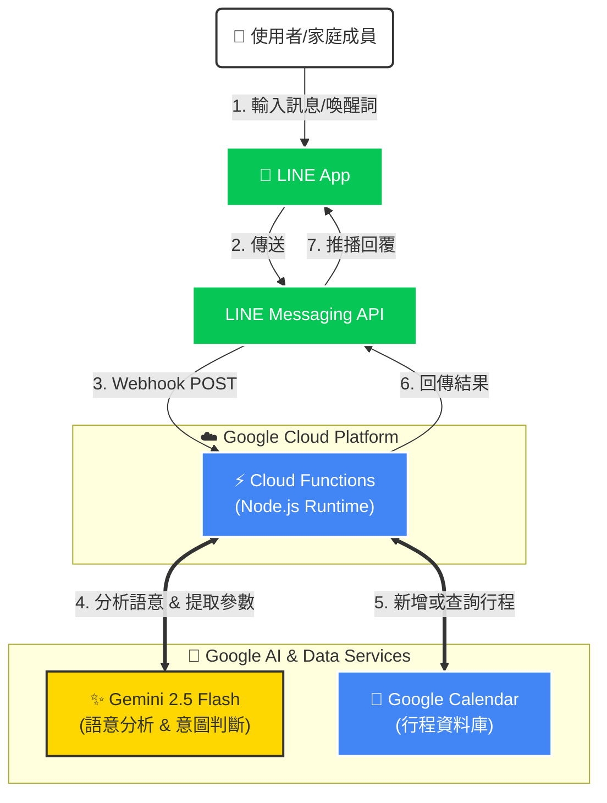

# 🤖 AI Butler - Line Bot with Gemini & Google Calendar

這是一個結合 **Google Gemini AI** 與 **Google Calendar** 的 LINE 聊天機器人。
它可以理解自然語言，協助家庭或個人透過 LINE 輕鬆管理行程。

## ✨ 功能特色 (Features)

* **自然語言處理**：不需要死板的指令，直接說「明天晚上七點吃飯」即可。
* **行程管理**：自動將行程同步至 Google Calendar。
* **行程查詢**：可以詢問「下週有哪些行程？」。
* **群組支援**：在群組中需使用喚醒詞「管家」開頭，避免干擾日常對話。
* **Serverless 架構**：部署於 Google Cloud Functions (Gen 2)，低成本且高穩定性。

## 🏗️ 系統架構 (Architecture)



## 🛠️ 技術棧 (Tech Stack)

* **Runtime**: Node.js 20
* **Cloud Platform**: Google Cloud Platform (Cloud Functions)
* **AI Model**: Google Gemini 1.5 Flash
* **Messaging**: LINE Messaging API
* **Database**: Google Calendar API

## 🚀 快速開始 (Quick Start)

### 前置需求

1. Google Cloud Platform 帳號 (需啟用 Billing)。
2. LINE Developers 帳號 (建立 Messaging API Channel)。
3. Gemini API Key (Google AI Studio)。

### 本地開發 (Local Development)

1. **Clone 專案**

    ```bash
    git clone [https://github.com/YourName/linebot-ai-butler.git](https://github.com/YourName/linebot-ai-butler.git)
    cd linebot-ai-butler
    ```

2. **安裝依賴**

    ```bash
    npm install
    ```

3. **設定環境變數**
    複製 `.env.example` 為 `.env` 並填入以下資訊：

    ```env
    CHANNEL_ACCESS_TOKEN=你的LINE_Token
    CHANNEL_SECRET=你的LINE_Secret
    GEMINI_API_KEY=你的Gemini_Key
    CALENDAR_ID=你的Google日曆ID
    ```

4. **啟動本地伺服器**

    ```bash
    npx @google-cloud/functions-framework --target=lineWebhook --port=8080
    ```

5. **使用 ngrok 進行測試**

    ```bash
    ngrok http 8080
    ```

    將 ngrok 網址貼回 LINE Developers Console 的 Webhook URL。

## ☁️ 部署 (Deployment)

使用 gcloud CLI 部署至 Google Cloud Functions：

```bash
gcloud functions deploy line-bot-function \
  --gen2 \
  --runtime=nodejs20 \
  --region=asia-east1 \
  --source=. \
  --entry-point=lineWebhook \
  --trigger-http \
  --allow-unauthenticated \
  --set-env-vars="CHANNEL_ACCESS_TOKEN=...,CALENDAR_ID=..."
```

## 📝 使用範例

* **新增行程**: 「管家，明天下午三點要帶兒子去打疫苗」
* **查詢行程**: 「管家，這禮拜有什麼行程?」

## 👤 Author

Developed by [YenCheng Lai](https://github.com/YenChengLai)
